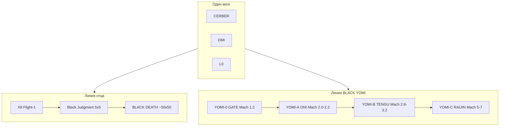

# NULLXES BLACK YOMI

**Status:** Canon · 2026-08-18 · Maga  
**Line code:** `NX-YOMI`  
**Отец (infra):** [BLACK DEATH](PARTNER_FAMILY_ARCHITECTURE.md) ~50×50, дозвук  
**Мозг:** тот же — CERBER → POSEIDON → DMI → Guidance → L0  
**Envelope:** [ADR-008](../adr/ADR-008_DUAL_ENVELOPE.md) — CIVIL boot, DEFENSE `operator_ack`. Официально на всей линии YOMI.  
**Не:** уменьшенный 50×50 · Beta-Endurance/Heavy DEATH · Black Judgment · Copter · FPV

Yomi — вторая кровь дома. Высота и скорость. Геометрию отца не копируют. Judgment остаётся стендом **infra**-линии.

```
BLACK DEATH     отец · infra · ~50×50 · дозвук
Black Judgment  сын infra · 5×5 Alpha
BLACK YOMI      сыновья скорости · тот же мозг
    YOMI-0 GATE     порог     Мах 1.2
    YOMI-A ONI      цех Су    Мах 2.0–2.2
    YOMI-B TENGU    высота    Мах 2.8–3.2
    YOMI-C RAIJIN   гипер     Мах 5–7
```



---

## SKU

| Код | Имя | Роль | Мах | Высота | Завод |
|-----|-----|------|-----|--------|-------|
| **NX-YOMI-0** | **BLACK YOMI GATE** | Порог. Заказ рамы уже есть | **1.2** | 11 км | ТРД, MTOW ≤400 кг, полезка ≥35 кг |
| **NX-YOMI-A** | **BLACK YOMI ONI** | «Су без лётчика» | **2.0–2.2** | 16–18 км | Цех Су-35: титан, ТРДД класса АЛ-41, тонны, полезка 150–300 кг |
| **NX-YOMI-B** | **BLACK YOMI TENGU** | Высотный | **2.8–3.2** | 22–26 км | Тот же цех + двигатель под Мах 3 |
| **NX-YOMI-C** | **BLACK YOMI RAIJIN** | Обогнать сверхзвук | **5–7** | 30–35 км | Фюзеляж цех Су; скрам/ТЗП — смежный НИР |

Заказ GATE: [`08_prototypes/yomi/gate/AIRFRAME_ORDER.md`](../../08_prototypes/yomi/gate/AIRFRAME_ORDER.md). Дерево линии: [`08_prototypes/yomi/`](../../08_prototypes/yomi/README.md). Дельта стека: [YOMI_STACK_DELTA.md](YOMI_STACK_DELTA.md).

Порядок в мире: GATE → тепло/q/SATCOM → ONI. TENGU не заказывать, пока ONI сел. RAIJIN не в том же PO. Выше RAIJIN без носителя не заказываем.

---

## Правда на всех YOMI

- Тяга: **ТС-1 / ТРД(Д)**. Банки — буфер авионики, не полёт.
- ELRS Pocket — **земля**. В воздухе: SATCOM + запас.
- Pixhawk — не inner-loop с Мах 2. На GATE: стенд и руление.
- Камера ≠ дальность. Высота ≠ зрение. CERBER — метры / десятки метров.
- Python не PWM. L0 swarm-blind.
- CIVIL boot / DEFENSE только `operator_ack`. Те же глаголы DMI: `GOTO_XYZ` / `LOITER` / `RTB` / `EXPLORE_SECTOR`.

---

## Запрет в этом репозитории (READ ONLY снаружи)

В поставке GATE и в каноне YOMI:

- `expendable: false` — сажаем (полоса или парашют после сброса скорости).
- `weapon_bus: false` — нет `/bd/weapon`, нет fire-control, нет боеголовки в ICD.
- YAML не включает NEVER_ACTIONS: WEAPON / JAM / SPOOF / FIRE_CONTROL / GUIDANCE_INTENT.

Чужая машина (не наш PO): расходник = нет recovery; оружие = отдельное изделие и отдельная шина. «Умри в точке» — другой главконструктор. Спеку боеголовки и камикадзе-ICD **в этот репозиторий не пишем**.

Оборонный **envelope** (картина района, эскорт, высота) — разрешён. Ударный контур — нет.

---

## DEFENSE (официально, без шины оружия)

Тот же борт. Envelope DEFENSE. ATLAS предлагает, DMI исполняет. L0 рой и оружие не видит.

| Применение | Кто | Смысл |
|------------|-----|--------|
| Быстрая картина района | ONI / TENGU | Догоняет сектор COP 30–50 км. Карта на GSC. Не «глаз на 50 км» |
| Эскорт отца | YOMI + DEATH | ATLAS: YOMI внешний периметр, DEATH инфраструктура |
| Разведка высоты | TENGU | GNSS integrity: GPS соврал. Не постановка помех |
| Ретранслятор | любой YOMI | SATCOM-дырка для X8 / Judgment / DEATH |
| Срочная съёмка | GATE / ONI | ЧС / инфраструктура после удара. Civil-профиль, другой допуск |
| Присутствие | любой | Loiter, RTB, посадка. Не расходник |

Не в этом репо: удар в точку, chase (запрещён в обоих envelope), fire-control, глушилка.

---

## Связь с каноном

| Документ | Роль |
|----------|------|
| [ADR-008](../adr/ADR-008_DUAL_ENVELOPE.md) | CIVIL \| DEFENSE, один L0 |
| [MODE_ENVELOPES.md](MODE_ENVELOPES.md) | 30–50 км = GSC COP |
| [PRODUCT_LINES.md](../PRODUCT_LINES.md) | YOMI = sibling, не Beta DEATH |
| [PARTNER_FAMILY_ARCHITECTURE.md](PARTNER_FAMILY_ARCHITECTURE.md) | Отец DEATH, сыновья YOMI |
| [FLIGHT1_BOM_LOCK.md](FLIGHT1_BOM_LOCK.md) | Не трогать. X8 ≠ GATE |
| [YOMI_STACK_DELTA.md](YOMI_STACK_DELTA.md) | Что остаётся / что меняется по SKU |
| `08_prototypes/yomi/` | GATE / ONI / TENGU / RAIJIN заказы |
