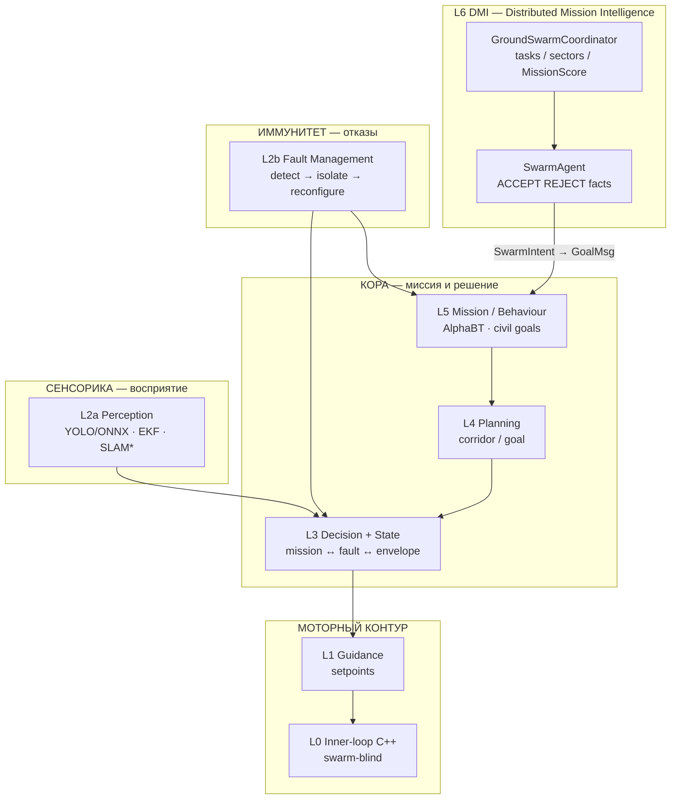
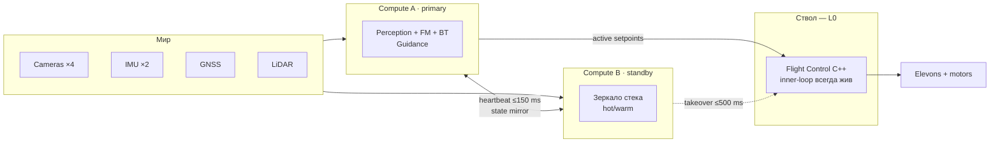
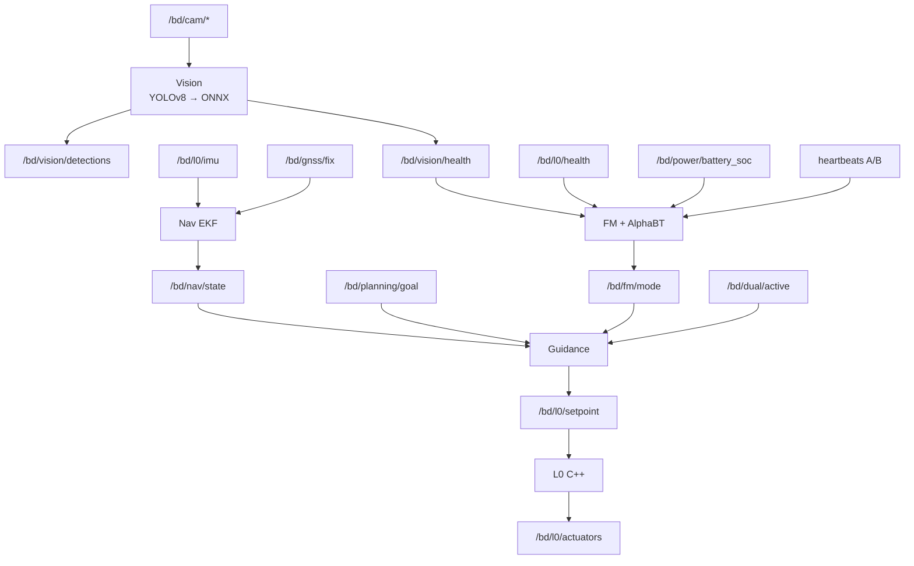
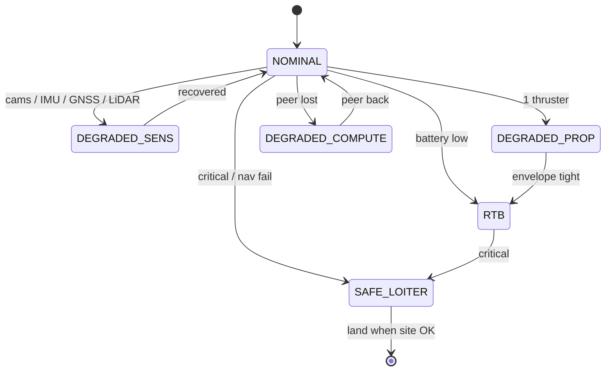
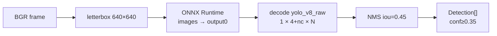

# Схема мозга — NULLXES autonomy

**Платформы:** BLACK DEATH (~50×50) · Black Judgment (5×5 Alpha)  
**Принцип:** onboard only · dual-compute · graceful degradation · civil modes  
**Стек:** Python 3.11 (L1–L5) · C++ (L0) · ROS 2 · ONNX  

Канон: [AUTONOMY_ARCHITECTURE](./AUTONOMY_ARCHITECTURE.md) · [PARTNER_FAMILY](./PARTNER_FAMILY_ARCHITECTURE.md) · [DMI_V1](./DMI_V1.md) · [ADR-002](../adr/ADR-002_DMI_V1.md)

---

## 1. Мозг целиком (слои)

\* SLAM — BLOCKED на Alpha Flight-1; EKF + vision работают по готовности драйверов/ONNX.  
DMI: L0 не знает про рой; см. [DMI_V1](./DMI_V1.md).

---

## 2. Полушария A / B (dual-compute)

Оба полушария видят сенсоры. Командует L0 только **active**. При смерти коры L0 держит hold / contingency.

---

## 3. Потоки данных (что чем питается)

---

## 4. Режимы поведения (civil)

---

## 5. Vision «глаз» (цифры)

| | |
|--|--|
| Классы (5) | person · vehicle · landing_pad · obstacle · cargo |
| Веса | `models/onnx/detector_alpha.onnx` + sha256 |
| Train | offline Ultralytics; в полёте только ONNX |

---

## 6. Карта «органов» → папки репо

| Орган | Слой | Путь |
|-------|------|------|
| Глаза | L2a vision | `06_autonomy/perception/vision/` |
| Вестибулярный / nav | L2a fusion | `06_autonomy/perception/fusion/` |
| Иммунитет | L2b | `06_autonomy/fault_management/` |
| Поведение | L5 | `06_autonomy/planning/behaviour/` |
| Моторика outer | L1 | `06_autonomy/control/guidance/` |
| Моторика inner | L0 | `05_avionics/flight_software/` |
| Полушария | dual | `06_autonomy/core/dual_compute/` |
| DMI / L6 | mission collective | `06_autonomy/dmi/` |
| Синапсы | bus | ROS 2 / `soft_bus` |

---

## 7. Одной фразой

> Сенсоры → восприятие + иммунитет → режим (AlphaBT) → guidance → **C++ L0**.  
> Два полушария A/B; ствол мозга (L0) не умирает вместе с Python.  
> DMI (L6) раздаёт задачи/секторы; **L0 swarm-blind**.
