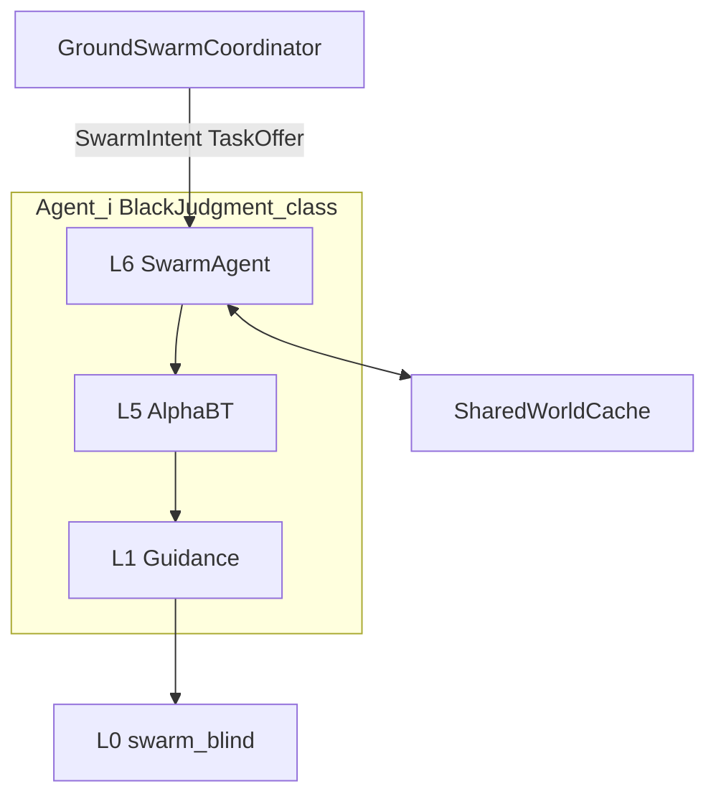

# DMI v1 — Distributed Mission Intelligence

**Canon:** [ADR-002](../adr/ADR-002_DMI_V1.md)  
**Partner synonym:** Collective Mission Intelligence (CMI)

> Several autonomous platforms act as one mission system while each can finish a degraded local mission if the coordination center is lost.

## Layers

| Layer | Owns | Does not own |
|-------|------|--------------|
| Ground Coordinator | mission, sectors, Mission Score allocation | setpoints, inner-loop |
| L6 SwarmAgent | ACCEPT/REJECT, facts out, last intent | L0 commands |
| L5–L1 | mode + guidance | swarm topology |
| L0 | attitude/thrust loop | any DMI knowledge |

## Mission Score (allocator)

Higher score wins the task offer (coordinator-side):

\[
S = w_d\cdot(1-\hat{d}) + w_s\cdot\mathrm{SOC} + w_p\cdot(1-\hat{p}) + w_h\cdot H
\]

| Symbol | Meaning | Default weight |
|--------|---------|----------------|
| \(\hat{d}\) | distance to task / sector ref, normalized to [0,1] | \(w_d=0.35\) |
| SOC | battery 0..1 | \(w_s=0.35\) |
| \(\hat{p}\) | payload fraction 0..1 | \(w_p=0.15\) |
| \(H\) | health 0..1 (from Swarm Health + FM) | \(w_h=0.15\) |

Coordinator publishes one `TaskOffer` to the winner; agent replies `ACCEPT` or `REJECT`. No dual claim: offer is exclusive until timeout or reject.

## Swarm Health

| State | Meaning |
|-------|---------|
| ONLINE | fresh status, healthy enough for new tasks |
| LIMITED | link or capability degraded; may keep current intent |
| LOST | aged out / no status |
| RECOVERED | transition back toward ONLINE after LOST/LIMITED |

## Shared World Cache

Facts: `{fact_id, kind, x,y,z, confidence, stamp_s, source_id}`  
Merge: same `fact_id` → keep higher confidence if fresher within TTL; else replace if newer.  
Not a SLAM map. Consumers treat facts as hints for planning/intent, not truth.

## Event-driven philosophy

DMI (and dual mirror-class) traffic publishes when something **meaningful** changes:

- new / changed SwarmIntent  
- new obstacle / world fact  
- FM mode change  
- peer/agent health transition  
- task offer / accept / reject  

Not: periodic spam of unchanged state at 50 Hz for DMI topics.

## Topics (`/bd/dmi/*`)

| Topic | Direction |
|-------|-----------|
| `/bd/dmi/intent` | coordinator → agents (or retained last) |
| `/bd/dmi/task_offer` | coordinator → one agent |
| `/bd/dmi/task_claim` | agent → coordinator |
| `/bd/dmi/agent_status` | agent → coordinator |
| `/bd/dmi/world_fact` | any → cache peers |
| `/bd/dmi/swarm_health` | agent/coordinator view |

Intent bridge on each ship maps accepted intent → `/bd/planning/goal` for existing guidance.

## Degraded: center lost

1. No new TaskOffer / sector reassignment.  
2. Agent keeps last accepted SwarmIntent.  
3. Local AlphaBT + FM still govern SAFE_LOITER / RTB.  
4. World facts may continue peer-to-peer if links allow (best-effort).

## Code

`06_autonomy/dmi/` · soft nodes `ros2/nodes/dmi_*_soft.py`
