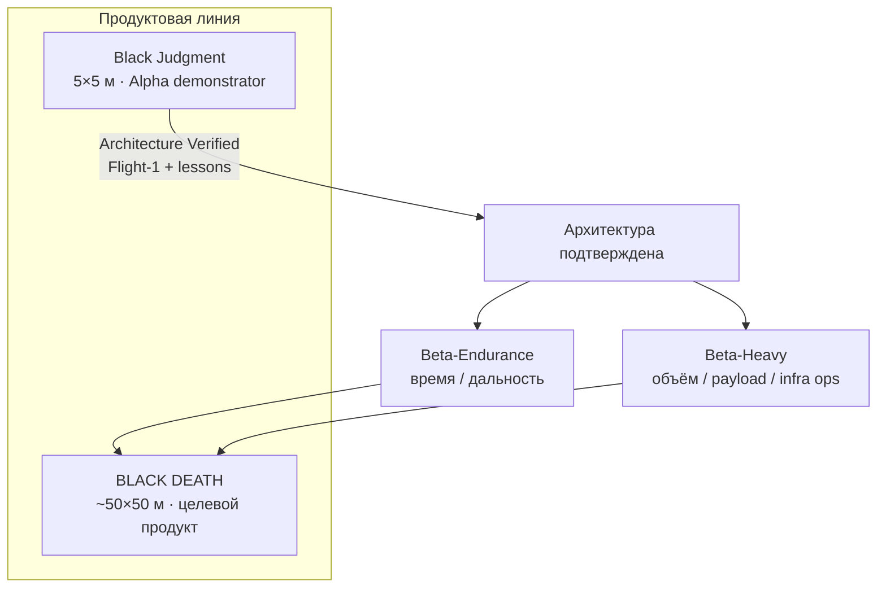
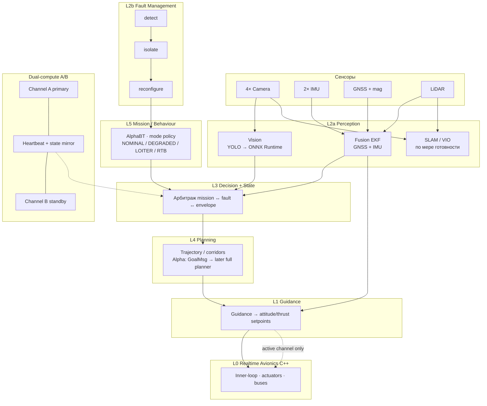
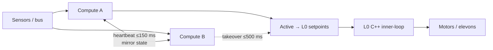

# NULLXES — архитектура семейства (для партнёров)

**Класс:** два тела, один мозг. Infra (BWB) + скорость (YOMI).  
**Envelope:** CIVIL (boot) \| DEFENSE (`operator_ack`) — [ADR-008](../adr/ADR-008_DUAL_ENVELOPE.md). DEFENSE официален на обеих линиях.  
**В репозитории нет:** munition bus, fire-control, `/bd/weapon`, камикадзе-ICD, постановщик помех.

| Платформа | Имя | Масштаб | Роль |
|-----------|-----|---------|------|
| **Старшая infra** | **BLACK DEATH** | ~**50 × 50 м** | Целевой продукт инфраструктуры |
| **Младшая infra** | **Black Judgment** | **5 × 5 м** (Alpha) | System Architecture Demonstrator |
| **Скорость** | **BLACK YOMI** | GATE → ONI → TENGU → RAIJIN | Сыновья отца по мозгу, не по геометрии 50×50 |

Канон: [ADR-001](../adr/ADR-001_ALPHA_ARCHITECTURE_DEMONSTRATOR.md) · [ADR-002 DMI](../adr/ADR-002_DMI_V1.md) · [ADR-008](../adr/ADR-008_DUAL_ENVELOPE.md) · [PRODUCT_LINES](../PRODUCT_LINES.md) · [BLACK_YOMI](./BLACK_YOMI.md) · [AUTONOMY_ARCHITECTURE](./AUTONOMY_ARCHITECTURE.md) · [BRAIN_SCHEME](./BRAIN_SCHEME.md) · [CERBER](./CERBER.md) · [DMI_V1](./DMI_V1.md)

---

## 1. Зачем две машины

| | **Black Judgment** (5×5) | **BLACK DEATH** (50×50) |
|--|-------------------------------|-------------------------|
| Вопрос, на который отвечает | «Мозг и нервы системы работают как целое под отказами?» | «Платформа несёт civil-миссии на инфраструктурном масштабе?» |
| Геометрия | Locked: \(b=5\) м, \(S=20\) м², \(AR=1.25\) | Целевая ~50×50; финальная форма — после Beta |
| MTOW / payload | **42 кг** / **10 кг** | Масштабируется (Beta-Heavy + energy) |
| Энергия | ≥**2.0 ч** @ \(V_{md}\) (health-check), **не** 6 ч | Product endurance / range — Beta-Endurance |
| Автономия | Тот же канон L0–L5, dual A/B, ONNX | **Port, don’t redesign** |
| Статус | **LOCKED** до Flight-1 | Видение продукта; железо/аэро — после Alpha |

**Важно для партнёров:** младшая рама **не** «мини-копия 50×50 по аэродинамике». Это стенд архитектуры. Старшая наследует **автономию и отказоустойчивость**, а не пропорции крыла Alpha.

### 1.1 BLACK YOMI — не Beta отца

Скоростная линия — **sibling**, не Beta-Endurance и не Beta-Heavy. Тот же мозг. Другое тело (ТРД, Мах, высота). Канон: [BLACK_YOMI.md](BLACK_YOMI.md).

| Код | Имя | Мах | Высота |
|-----|-----|-----|--------|
| NX-YOMI-0 | BLACK YOMI GATE | 1.2 | 11 км |
| NX-YOMI-A | BLACK YOMI ONI | 2.0–2.2 | 16–18 км |
| NX-YOMI-B | BLACK YOMI TENGU | 2.8–3.2 | 22–26 км |
| NX-YOMI-C | BLACK YOMI RAIJIN | 5–7 | 30–35 км |

Заказ порога: [`08_prototypes/yomi/gate/AIRFRAME_ORDER.md`](../../08_prototypes/yomi/gate/AIRFRAME_ORDER.md). Дельта: [YOMI_STACK_DELTA.md](YOMI_STACK_DELTA.md). GATE → ONI → TENGU. RAIJIN не в том же PO.

---

## 2. Civil mission envelope (обе платформы)

1. Logistics  
2. Energy & Grid (inspection / support)  
3. Disaster Response  
4. Construction Support  
5. Transportation (cargo / limited pax per safety)  
6. Infrastructure inspection & support  

Режимы безопасности (civil): `NOMINAL` → `DEGRADED_*` → `SAFE_LOITER` / `RTB`.

---

## 3. Младшая рама — Black Judgment (5×5)

### 3.1 Airframe (locked)

| Параметр | Значение |
|----------|----------|
| Размах × характерный размер | **5 × 5 м** compact BWB |
| \(S\) / \(AR\) | **20 м²** / **1.25** |
| MTOW / payload | **42 кг** / **10 кг** |
| Тяга | 2× electric pusher (12S); VTOL-assist опционально, Flight-1 = CTOL |
| Батарея (rev A) | **16 кг** usable ~2880 Wh @ 180 Wh/kg |
| Cruise envelope | 90–110 км/ч dash; endurance @ \(V_{md}\) |

### 3.2 Sensors & compute (Alpha)

| Подсистема | Состав |
|------------|--------|
| Vision | 4× GS **1280×720@30** (FOV 90°/90°/110°/110°) |
| Nav | 2× IMU (≥0.4 м разнос) + multi-band GNSS + mag |
| Range | 1× LiDAR ≥40 м, ≥10 Hz |
| Compute | **A/B** независимые SBC; L1–L5 Python **3.11** |
| Realtime | L0 **C++17/20** (inner-loop не зависит от Python) |
| Middleware | **ROS 2 Jazzy+** |
| Inference | **ONNX Runtime** onboard (YOLO detect); без cloud LLM |

### 3.3 Acceptance Flight-1 (что доказываем партнёру)

Без облака и без обязательного пилота в autonomy-loop:

1. CTOL взлёт  
2. Hold / guided mode  
3. Потеря одного compute → failover ≤ **500 ms**  
4. Корректный degraded / SAFE_LOITER / RTB  
5. Завершение полёта предсказуемо  

---

## 4. Старшая платформа — BLACK DEATH (~50×50)

### 4.1 Продуктовое видение

| | Намерение |
|--|-----------|
| Форма | Civil flying wing / BWB инфраструктурного класса ~**50 × 50 м** |
| Назначение | Те же civil-миссии на объёме, дальности и payload, недоступных 5×5 |
| Путь | Alpha verified → Beta-Endurance **и/или** Beta-Heavy → сборка уроков в 50×50 |
| Автономия | Тот же стек слоёв L0–L5, dual-compute, FM, ONNX; масштаб железа и сенсоров растёт |

### 4.2 Что **не** фиксируем сейчас (честно для R&D)

- Точные MTOW / Wh / \(AR\) финальной 50×50  
- Финальный propulsor mix (electric → возможный hybrid позже)  
- Полный набор hardpoints / грузовых отсеков  

Это открывается **ADR-021** только после `ALPHA_LESSONS_LEARNED`.

### 4.3 Что уже фиксируем как архитектуру продукта

- Onboard-only decision path (нет внешнего LLM в контуре)  
- Dual-compute + graceful degradation  
- Разделение **guidance (Python)** / **inner-loop (C++)**  
- Civil safety modes, не боевые  
- Модели только локальный ONNX  

---

## 5. Схема ИИ / автономии (общая для обеих)

Одинаковый «мозг»; на 50×50 — больше compute/sensors, **не другая философия**.

### 5.1 Слои (кратко)

| Слой | Содержание | Язык |
|------|------------|------|
| **L5** | Миссия / режимы (`AlphaBT`) | Python 3.11 |
| **L4** | Траектория / коридоры | Python |
| **L3** | Decision + state / health | Python |
| **L2a** | Vision (YOLO/ONNX), fusion, SLAM | Python |
| **L2b** | FM: detect → isolate → reconfigure | Python |
| **L1** | Guidance → setpoints | Python |
| **L0** | Inner-loop, drivers, ESC | **C++** |
| Шина | ROS 2 topics (одинаковые имена на железе и twin) | — |

### 5.2 Vision (цифры Alpha)

| Параметр | Значение |
|----------|----------|
| Модель | Ultralytics **YOLOv8** → flight **ONNX** (`yolo_v8_raw`) |
| Вход | **640×640**, `images` → `output0` |
| conf / iou | **0.35** / **0.45** |
| Классы | person · vehicle · landing_pad · obstacle · cargo |
| Runtime | ONNX Runtime (CUDA EP → CPU fallback) |

Train/export — offline (`torch` + `ultralytics`); в полёте только ONNX + sha256.

### 5.3 Dual-compute

При смерти high-level Python L0 удерживает safe/hold contingency.

---

## 6. Стек (зафиксирован)

| Слой | Технология |
|------|------------|
| Host | **Windows / Linux** |
| Autonomy | Python **3.11** |
| Realtime | C++ **17/20** |
| Middleware | ROS 2 **Jazzy+** |
| Inference | ONNX Runtime (+ TensorRT/OpenVINO по железу) |
| Sim (позже) | Gazebo (WSL2), AirSim — twin по тем же топикам |

**Нет** в полётном контуре: cloud LLM, внешние inference API.

---

## 7. Roadmap для партнёра (без обещаний «уже летает 50×50»)

| Этап | Результат |
|------|-----------|
| **Сейчас** | Контракты + алгоритмы; Vision **BLOCKED** без реального ONNX; **DMI v1** modules |
| **Practice** | edu (~авг) → Skywalker X8 PNP Flight-1 (~сент) — шина / L0 / DMI intent |
| **Alpha Flight-1** | **Black Judgment** доказывает архитектуру одной машины |
| **DMI multi-agent** | N× Judgment-class; L0 swarm-blind; partner term **CMI** = DMI |
| **Lessons + ADR-021** | Открытие Beta-Endurance / Beta-Heavy |
| **BLACK DEATH 50×50** | Продуктовый масштаб на проверенном мозге |

---

## 8. Одной фразой

> **Black Judgment (5×5)** — младшая рама, на которой мы доказываем гражданский автономный мозг.  
> **NULLXES CERBER** — система восприятия (не «одна нейросеть»).  
> **DMI** — несколько автономных платформ как одна миссионная система; L0 не знает про рой.  
> **BLACK DEATH (50×50)** — старшая инфраструктурная платформа, которая наследует этот мозг и наращивает тело под civil-миссии.

Контакты по инженерии / NDA — вне этого файла; технический канон в `00_docs/`.
